# Data Model

## Overview

The Eventz database contains **30 tables** across 8 domains, managed via Supabase PostgreSQL with Row-Level Security (RLS). Two tables (`comments`, `likes`) are dead duplicates and should be dropped.

## Table Inventory by Domain

### Identity

| Table | Purpose | Rows |
|-------|---------|------|
| `profiles` | Core user profile (supplements `auth.users`) | 1 per user |
| `user_roles` | Role-based access (admin, moderator, user) | 0-1 per user |
| `organizer_profiles` | Legacy organizer metadata (deprecated, FK missing) | 0-1 per user |

### Events

| Table | Purpose | Rows |
|-------|---------|------|
| `events` | Core event entity with JSONB ticket tiers, streaming config, highlights | 1 per event |
| `event_likes` | Users who saved/liked an event | N per event |

### Tickets & Payments

| Table | Purpose | Rows |
|-------|---------|------|
| `tickets` | Purchased ticket with barcode, price (text), scan status | 1 per purchase |
| `transactions` | Payment ledger (nTZS wallet, pending/completed status) | 1 per payment attempt |
| `idempotency_keys` | Prevents duplicate financial operations (24h TTL) | 1 per operation |

### Messaging

| Table | Purpose | Rows |
|-------|---------|------|
| `conversations` | 1:1 DM conversation between two users | 1 per pair |
| `messages` | Individual message in a conversation | N per conversation |
| `stream_chat_messages` | Live stream chat (per event) | N per event |

### Social

| Table | Purpose | Rows |
|-------|---------|------|
| `follows` | Follower/following relationships (CASCADE) | N per user |
| `post_likes` | Likes on posts (CASCADE) | N per post |
| `post_comments` | Comments on posts with threading (`parent_id`) | N per post |
| `comment_likes` | Likes on comments | N per comment |
| `saved_events` | Bookmarked events with optional reminder | N per user |
| `saved_posts` | Bookmarked posts | N per user |

### Media & Streaming

| Table | Purpose | Rows |
|-------|---------|------|
| `cloudflare_streams` | Cloudflare Stream VOD/live metadata | N per user |
| `user_media` | User-uploaded media (images, videos) | N per user |

### Notifications & Email

| Table | Purpose | Rows |
|-------|---------|------|
| `notifications` | In-app notification events | N per user |
| `push_subscriptions` | Web push endpoint registrations | N per device |
| `email_preferences` | Per-user email category opt-ins | 1 per user |
| `email_deliveries` | Delivery log from Resend provider | N per email |

### Moderation & System

| Table | Purpose | Rows |
|-------|---------|------|
| `reports` | User-generated content reports | N per report |
| `user_blocks` | Block relationships between users | N per user |
| `audit_logs` | Admin action audit trail | N per action |
| `feature_flags` | Feature toggle configuration | N per flag |

### Dead Tables (Drop Candidates)

| Table | Duplicate Of | Evidence |
|-------|-------------|----------|
| `comments` | `post_comments` | Zero API references; `post_comments` adds `parent_id` for threading |
| `likes` | `post_likes` | Identical schema; `post_likes` used everywhere |

## Entity Relationship Diagram

```mermaid
erDiagram
    profiles ||--o{ events : "organizes"
    profiles ||--o{ posts : "authors"
    profiles ||--o{ tickets : "purchases"
    profiles ||--o{ transactions : "makes"
    profiles ||--o{ follows : "follows"
    profiles ||--o{ followings : "followed by"
    profiles ||--o{ messages : "sends"
    profiles ||--o{ conversations : "participant1"
    profiles ||--o{ conversations2 : "participant2"
    profiles ||--o{ post_likes : "likes"
    profiles ||--o{ post_comments : "comments"
    profiles ||--o{ comment_likes : "likes"
    profiles ||--o{ event_likes : "likes"
    profiles ||--o{ saved_events : "saves"
    profiles ||--o{ saved_posts : "saves"
    profiles ||--o{ stream_chat_messages : "chats in"
    profiles ||--o{ cloudflare_streams : "streams"
    profiles ||--o{ user_media : "uploads"
    profiles ||--o{ notifications : "receives"
    profiles ||--o{ notifications2 : "acts in"
    profiles ||--o{ reports : "reports"
    profiles ||--o{ reports2 : "reported"
    profiles ||--o{ user_blocks : "blocks"
    profiles ||--o{ user_blocks2 : "blocked by"
    profiles ||--o{ user_roles : "has role"
    profiles ||--o{ push_subscriptions : "subscribes"
    profiles ||--o{ email_preferences : "prefs"
    profiles ||--o{ audit_logs : "audited"
    profiles ||--o{ idempotency_keys : "keys"

    events ||--o{ tickets : "sells"
    events ||--o{ posts : "tagged in"
    events ||--o{ event_likes : "liked"
    events ||--o{ saved_events : "saved"
    events ||--o{ stream_chat_messages : "live chat"
    events ||--o{ cloudflare_streams : "recorded"
    events ||--o{ transactions : "paid for"
    events ||--o{ user_media : "media at"

    tickets ||--o{ transactions : "paid via"

    posts ||--o{ post_likes : "liked"
    posts ||--o{ post_comments : "commented"
    posts ||--o{ saved_posts : "saved"

    post_comments ||--o{ comment_likes : "liked"
    post_comments ||--o{ post_comments : "replies to (self-ref)"
```

## Key Relationships & Cardinalities

| Relationship | Type | FK Column | ON DELETE |
|-------------|------|-----------|-----------|
| events → profiles | N:1 | `organizer_id` | RESTRICT |
| posts → profiles | N:1 | `user_id` | CASCADE |
| posts → events | N:1 | `event_id` | SET NULL |
| tickets → events | N:1 | `event_id` | RESTRICT |
| tickets → profiles | N:1 | `user_id` | CASCADE |
| transactions → events | N:1 | `event_id` | SET NULL |
| transactions → tickets | N:1 | `ticket_id` | SET NULL |
| transactions → profiles | N:1 | `user_id` | CASCADE |
| conversations → profiles | 1:2 | `participant1_id`, `participant2_id` | CASCADE |
| messages → conversations | N:1 | `conversation_id` | CASCADE |
| messages → profiles | N:1 | `sender_id` | CASCADE |
| follows → profiles | N:2 | `follower_id`, `following_id` | CASCADE |
| post_likes → posts | N:1 | `post_id` | CASCADE |
| post_likes → profiles | N:1 | `user_id` | CASCADE |
| post_comments → posts | N:1 | `post_id` | CASCADE |
| post_comments → profiles | N:1 | `user_id` | CASCADE |
| post_comments → post_comments | N:1 | `parent_id` | SET NULL |
| comment_likes → post_comments | N:1 | `comment_id` | CASCADE |
| comment_likes → profiles | N:1 | `user_id` | CASCADE |
| event_likes → events | N:1 | `event_id` | CASCADE |
| event_likes → profiles | N:1 | `user_id` | CASCADE |
| saved_events → events | N:1 | `event_id` | CASCADE |
| saved_events → profiles | N:1 | `user_id` | CASCADE |
| saved_posts → posts | N:1 | `post_id` | CASCADE |
| saved_posts → profiles | N:1 | `user_id` | CASCADE |
| stream_chat_messages → events | N:1 | `event_id` | RESTRICT |
| stream_chat_messages → profiles | N:1 | `user_id` | CASCADE |
| cloudflare_streams → events | N:1 | `event_id` | SET NULL |
| cloudflare_streams → profiles | N:1 | `user_id` | CASCADE |
| user_media → events | N:1 | `event_id` | SET NULL |
| user_media → profiles | N:1 | `user_id` | CASCADE |
| notifications → profiles | N:2 | `user_id`, `actor_id` | CASCADE |
| reports → profiles | N:3 | `reporter_id`, `reported_user_id`, `resolved_by` | SET NULL |
| user_blocks → profiles | N:2 | `blocker_id`, `blocked_id` | CASCADE |
| idempotency_keys → auth.users | N:1 | `user_id` | CASCADE |
| push_subscriptions → auth.users | N:1 | `user_id` | CASCADE |
| email_preferences → profiles | 1:1 | `user_id` (PK) | CASCADE |
| email_deliveries → profiles | N:1 | `user_id` | SET NULL |

## Primary Keys

| Table | PK Column | Type | Generation |
|-------|-----------|------|------------|
| profiles | `id` | uuid | Matches `auth.users.id` |
| events | `id` | bigint | `bigserial` |
| tickets | `id` | bigint | `bigserial` |
| transactions | `id` | bigint | `bigserial` |
| posts | `id` | bigint | `bigserial` |
| conversations | `id` | bigint | `bigserial` |
| messages | `id` | bigint | `bigserial` |
| follows | `id` | bigint | `bigserial` |
| post_likes | `id` | bigint | `bigserial` |
| post_comments | `id` | bigint | `bigserial` |
| comment_likes | `id` | bigint | `bigserial` |
| event_likes | `id` | bigint | `bigserial` |
| saved_events | `id` | bigint | `bigserial` |
| saved_posts | `id` | bigint | `bigserial` |
| stream_chat_messages | `id` | bigint | `bigserial` |
| cloudflare_streams | `id` | bigint | `bigserial` |
| user_media | `id` | bigint | `bigserial` |
| notifications | `id` | bigint | `bigserial` |
| reports | `id` | uuid | `gen_random_uuid()` |
| user_blocks | `blocker_id, blocked_id` | uuid | Composite PK |
| audit_logs | `id` | uuid | `gen_random_uuid()` |
| feature_flags | `id` | uuid | `gen_random_uuid()` |
| push_subscriptions | `id` | uuid | `gen_random_uuid()` |
| idempotency_keys | `id` | uuid | `gen_random_uuid()` |
| email_preferences | `user_id` | uuid | PK = FK |
| email_deliveries | `id` | uuid | `gen_random_uuid()` |
| organizer_profiles | `id` | uuid | Matches `auth.users.id` |
| user_roles | `id` | uuid | `gen_random_uuid()` |

## Unique Constraints

| Table | Columns | Notes |
|-------|---------|-------|
| `conversations` | `(participant1_id, participant2_id)` | Prevents duplicate DMs |
| `follows` | `(follower_id, following_id)` | Prevents duplicate follows |
| `post_likes` | `(post_id, user_id)` | One like per user per post |
| `post_comments` | No unique constraint | Allows multiple comments |
| `comment_likes` | `(comment_id, user_id)` | One like per user per comment |
| `event_likes` | `(event_id, user_id)` | One like per user per event |
| `saved_events` | `(event_id, user_id)` | One save per user per event |
| `saved_posts` | `(post_id, user_id)` | One save per user per post |
| `tickets` | `(event_id, ticket_number)` | Unique ticket numbers per event |
| `cloudflare_streams` | `(uid)` | Cloudflare Stream UID |
| `push_subscriptions` | `(endpoint)` | Unique push endpoint |
| `reports` | `(reporter_id, content_type, content_id) WHERE status IN ('open','reviewing')` | Partial unique — one open report per content |
| `idempotency_keys` | `(user_id, key)` | Prevents duplicate operations |

## Notable Design Decisions

### JSONB Columns

The `events` table uses JSONB for complex nested data:

- **`streaming`**: Provider config, `live_input_uid`, `stream_key`, `playback_url`, `isLive`, `liveViewers`. Contains RTMP `stream_key` — security risk if RLS allows public SELECT.
- **`ticket_tiers`**: Array of `{name, price, available, features, color}`. Price stored as text inside JSONB. `available` count decremented by `purchase_ticket` RPC using `FOR UPDATE` row locking.
- **`event_highlights`**: Array of `{image, video, caption, type, mediaType}`.

**Trade-off**: Flexibility over constraints. No DB-level validation on JSONB structure, no indexes on nested fields.

### Hard Deletes (No Soft Deletes)

All deletes use `ON DELETE CASCADE` with hard deletes. No `deleted_at` timestamps exist. `delete_event_complete` RPC permanently removes events and cascades to tickets, posts, chat messages, likes, saved events, and streams.

**Impact**: Accidental deletion is irreversible. No recovery mechanism or audit trail.

### Price Stored as `text`

`tickets.price` is `text` type (e.g., `"TZS 15,000"`). Revenue calculations in RPCs use `CAST(REGEXP_REPLACE(price, '[^0-9]', '', 'g') AS INTEGER)`. This prevents native SQL aggregation and is fragile.

### Profile Trigger Protection

A `check_profile_updates()` trigger fires BEFORE UPDATE on `profiles` to prevent privilege escalation on `is_organizer`, `verified`, and `organizer_type`. RPCs like `become_organizer` and `downgrade_to_personal_account` bypass this using `SET app.bypass_profile_trigger = 'true'`.

### RLS Everywhere

All 30 tables have RLS enabled. Policies enforce:
- User-scoped reads (`auth.uid() = user_id`)
- Participant-scoped messaging (via conversation subquery)
- Admin/moderator role checks via `auth.jwt() -> 'app_metadata' ->> 'role'`
- RPC-only ticket creation (INSERT policy dropped on `tickets`)
